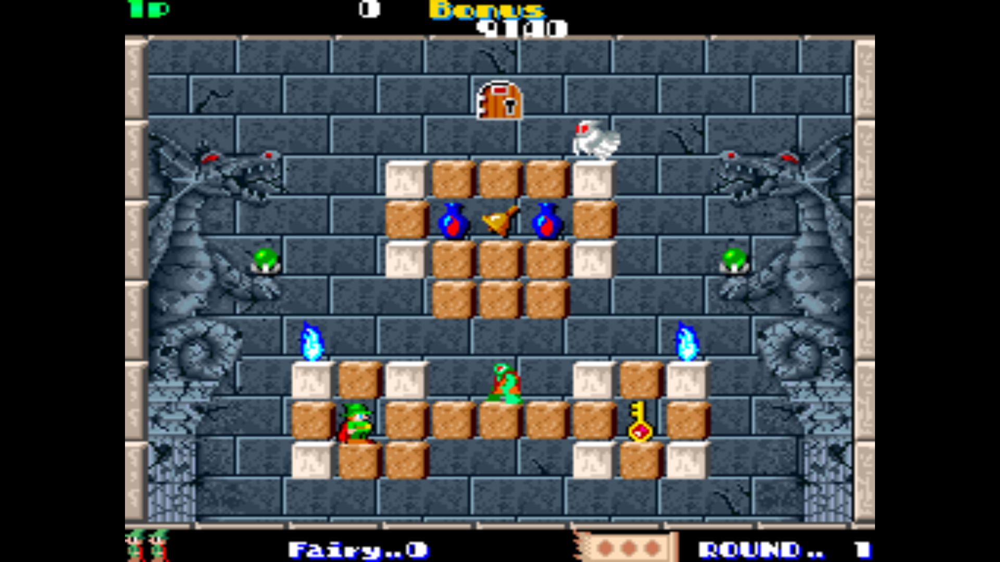

[This](https://mdodis.itch.io/open-solomons-key) was my first attempt at creating and publishing my very first real *game*. Obviously, it's not *my* game; it's a remake of the classic arcade game from 1986. But it was a very interesting process that's worth discussing.

## Rules
So, I started with the question: "What do I want to learn from doing this?". I'm interested in game engine development and I wanted to finally *make* something that isn't overly ambitious and would take years to complete. Let's take a look at the rules:

- No game engines or game frameworks
- Minimize the number of libraries used
- Ship for at least two platforms
- Be as close to the original as possible

The last part was pretty interesting and will be covered in more detail later in this post.

## Influences
One major influence was [Handmade Hero](https://handmadehero.org/), that I discovered randomly on YouTube; one of the very few and far between cases where the YouTube suggestion algorithm actually did produce something meaningful! The code is pretty similar to it then (if a tad too amateur-ish).

Since I wasn't even alive when this game was being played, I used the original ROM with [MAME](https://www.mamedev.org/) as a reference for everything.

## Gameplay



### Premise

The game is a blend of the various side-scrollers of the time with some interesting puzzle elements. I wouldn't say it's the hardest arcade game out there, but it was an *arcade game* so an inherent difficulty in everything was commonplace.

You are Dana. With 64 levels (of which 15 are secrets), you are tasked to find the door in each one, unlock it using the key and go through it before the time limit expires. There are other collectibles that grant you points towards your end level score, and enemies with different behaviors that you must avoid or defeat.

To accomplish this task, you can use your wand to manipulate some of the blocks in the level; destroy or create them to forge your own path, block enemies or open up pathways. The wand can also cast fireballs that move along the block edges and destroy enemies.

### Points of Interest

The key point of the game is the manipulation of blocks. Almost all of the enemies have interesting behaviors modeled around the existence (or not) of blocks, and their properties. The simplest example is the first enemy you encounter: the goblin.

- The goblin will move towards the left until it finds a block.
    - It will punch it, then turn around and start walking on the opposite direction.
    - If the block will be then destroyed if it was a destructible block
- If the goblin notices Dana, it will chase him with increased speed
- If the block that the goblin is on top of is destroyed, it will fall and be destroyed.

One of my personal favorites, the spark, has the following behavior:

- Like fireballs, it will traverse along the edges of blocks no matter their alignment
- If the block that it's on is destroyed, it will fly off in the direction it was last traveling towards.
- It cannot be defeated.

This immediately adds a huge array of possibilities for manipulating these enemies. There are cases, for example, where you can force the spark into a place in the level where it is completely trapped; endlessly looping around a small area

## Implementation

Behold!


The implementation consists of the first 6 levels of the original, along with a simple text format for levels (and a partial editor in osked). Enemies present in the first 6 levels have all been implemented, as well the key mechanics and collectibles of the game.

This has been tested to work on Windows and Linux (Ubuntu & Fedora), with unstable support for the Raspberry Pi 3 based on feedback from a user.

Obviously, one pain point of these kind of remakes, is that while I can distribute source code, I'm not exactly sure if I'm allowed to redistribute assets and I'm not really willing to test the waters in this manner. The release builds do have assets of course, but they aren't bundled with the source code in the GitHub repository. So, there is still *some* possibility for a bunch of strong-armed thugs to come and take me away; to which end I leave the task of rationing all my personal effects to my cat.


### Replication

I would be lying if I stated that this game plays exactly like the original. I now have the gift of hindsight, acquired knowledge and appreciation for the game that I can happily state that this is not even *close* to the arcade game! I know, such a positive statement.

Granted, as good as MAME is, I'm not exactly sure of the accuracy with which it can emulate the old hardware this game ran on, not owning the arcade machine myself. But it runs the ROM, so I was forced to treat it as the basis of how the game played. So, how was it done? Did I transpile the assembly code to one I understand, emulate it and ensure that the behavior is the same? Oooh, or did I translate the input from my game into input for MAME, and try to see that it was at least statistically replicating the behavior by any satisfiable (albeit self-imposed) measure of likeness?

No, I was much more naive at the time; I was at the early stages of programming after all! As you might imagine, I just played both versions of the game over and over and over again until I felt it was *good enough*.


## Reception

One cannot simply explain the pure happiness and joy in seeing your creation garner interest, and even feedback. It is inexplicably intoxicating and inspiring to see even one random person on the internet state: "Hey, the game looks ok, but I don't have audio. I ran it on my linux machine.". Some people even helped to fix engine bugs, and even showed me how to support other platforms and configurations.

There was even a review on a indie retro news site! I will forever remember those days and feelings, and for all the time it took for me to make this: *It was completely worth it*.

## Review

I think it'd be worthwhile to examine segments of the code that I see as interesting. So let's go on and trash this code, shall we?

### Entities

I would've changed a lot of things about the code, had I done this today. The main thing is how entities were handled; to this day I rack my brains contemplating: "How did I ever consider this a reasonable way to model entities for the game?". Let's have a detailed look at the code to see how *bad* it is:

Each entity only consists of its type, and 7 customizable parameters that can be used to store state. This is terrible and I can't for the sake of me remember why I thought it was a good idea; Maybe because I can then store the entities contiguously in an array, for the sake of performance? Being aware of performance is good of course, but not at the expense of developing the actual behavior.
```c++
union CustomParameter {
    u64    as_u64;
    double as_f64;
    i64    as_i64;
    EnemyType as_etype;
    PickupType as_ptype;
    void *as_ptr;
};

struct Entity {
    EntityType type;
    CustomParameter params[MAX_ENTITY_PARAMS];
};
```

Let's look at another *mistake*: Each entity only has one function: `update`.
```c++
UPDATE_ENTITY_FUNC2(Goblin_update, goblin) {
    // Code for goblin ...
}
```
I can't even begin to list the reasons for which this is was a bad take on entities, so I won't even bother going into it. One major thing it lead to was huge update functions that try to infer the state of the entity from animation state, instead of just storing an integer sometimes. Here's the goblin's `update` logic:

```c++
UPDATE_ENTITY_FUNC2(Goblin_update, goblin) {
  /*
  NOTE: Sprite::mirror is a bool, and sprites by default look to the left,
  so invert direction vector to get the axis-compliant direction in X.
  */

  double &goblin_walk_speed = goblin->entity.params[1].as_f64;
  const float goblin_run_speed = 120;
  b32 ignore_player = false;
  b32 is_dying = goblin->current_animation == GET_CHAR_ANIMENUM(Goblin, Fall);
  u64 &ignore_air_death = goblin->entity.params[3].as_u64;
  u64 &tile_hit_was_frail = goblin->entity.params[4].as_u64;
  ignore_player = is_dying;

  if (goblin->current_animation == GET_CHAR_ANIMENUM(Goblin, Punch) ||
      goblin->current_animation == GET_CHAR_ANIMENUM(Goblin, Wait)) {
    // Switch direction and continue when either of these states ends
    if (!goblin->animation_playing) {
      if (!(goblin->current_animation == GET_CHAR_ANIMENUM(Goblin, Punch) &&
            tile_hit_was_frail)) {
        goblin->mirror.x = !goblin->mirror.x;
      }
      SET_ANIMATION(goblin, Goblin, Walk);
    } else {
      ignore_player = true;
    }
  }

  // Chase
  {
    const Sprite *const player = find_first_sprite(ET_Player);
    fail_unless(player, "Player sprite not found scene_get_first_sprite");

    fvec2 ppos = player->position;
    ivec2 ppos_tile = map_position_to_tile_centered(ppos);

    ivec2 goblin_tile = map_position_to_tile_centered(goblin->position);

    if (goblin_tile.y == ppos_tile.y && !ignore_player) {
      // search in the direction of the goblin to see if there is
      // an obstacle blocking its view of the player
      i32 tdiff = sgn(goblin_tile.x - ppos_tile.x);

      ivec2 block_tile = scene_get_first_nonempty_tile(goblin_tile, ppos_tile);
      if (block_tile == ivec2{-1, -1}) {
        persist i32 blocking_tiles = 0;

        if (tdiff == -goblin->direction()) {
          SET_ANIMATION(goblin, Goblin, Chase);
        }
      } else {
#ifndef NDEBUG
        gl_slow_tilemap_draw(&GET_TILEMAP_TEXTURE(TM_essentials),
                             {block_tile.x * 64.f, block_tile.y * 64.f},
                             {64.f, 64.f}, 0, 1 * 5 + 2, false, false,
                             NRGBA{0.f, 1.f, 1.f, 1.f});
#endif
      }
    }
  }

  // Stop at tile edges
  if (!is_dying) {
    const i32 block_stop_offset = 32;
    const ivec2 goblin_tile = map_position_to_tile_centered(goblin->position);
    ivec2 dir_tile = map_position_to_tile_centered(
        goblin->position + fvec2{goblin->direction() * block_stop_offset, 0});
    ivec2 dir_tile_under = dir_tile + ivec2{0, 1};

#ifndef NDEBUG
    gl_slow_tilemap_draw(&GET_TILEMAP_TEXTURE(TM_essentials),
                         {dir_tile_under.x * 64.f, dir_tile_under.y * 64.f},
                         {64, 64}, 0, 1 * 5 + 1, false, false,
                         NRGBA{1.f, 0.f, 0.f, 1.f});
#endif
    if (scene_get_tile(dir_tile_under) == ET_EmptySpace &&
        scene_get_tile(dir_tile) == ET_EmptySpace && goblin_tile.y != 11) {
      SET_ANIMATION(goblin, Goblin, Wait);
      goblin->velocity.x = 0;
    }
  }

  // Punching
  {
    const float punch_offset_amount = 32;
    const float punch_offset = goblin->direction() * (punch_offset_amount);
    const ivec2 goblin_tile = map_position_to_tile(goblin->position);
    const b32 is_at_edge_of_map =
        (goblin_tile.x == 14 && goblin->direction() == 1) ||
        (goblin->position.x <= 2 && goblin->direction() == -1);

    ivec2 tile_index = map_position_to_tile_centered(goblin->position +
                                                     fvec2{punch_offset, 0});
#ifndef NDEBUG
    gl_slow_tilemap_draw(&GET_TILEMAP_TEXTURE(TM_essentials),
                         {tile_index.x * 64.f, tile_index.y * 64.f}, {64, 64},
                         0, 1 * 5 + 1, false, false, NRGBA{0.f, 1.f, 0.f, 1.f});
#endif
    if ((scene_get_tile(tile_index) != ET_EmptySpace || is_at_edge_of_map) &&
        !(goblin->is_on_air)) {
      tile_hit_was_frail = is_frail_block(tile_index);

      if (tile_hit_was_frail) {
        scene_hit_frail_block(tile_index);
      }

      SET_ANIMATION(goblin, Goblin, Punch);
    }
  }

  // Movement
  i32 move_amount;
  switch (goblin->current_animation) {
    case GET_CHAR_ANIMENUM(Goblin, Walk):
      move_amount = goblin_walk_speed;
      break;

    case GET_CHAR_ANIMENUM(Goblin, Chase):
      move_amount = goblin_run_speed;
      break;

    default:
      move_amount = 0;
      break;
  }

  // goblin can't fall while punching a wall
  if (goblin->current_animation != GET_CHAR_ANIMENUM(Goblin, Punch)) {
    goblin->move_and_collide(dt, 900, 450, 450,
                             move_amount * goblin->direction());
  }

  if (goblin->velocity.y == 0 && !goblin->is_on_air) {
    ignore_air_death = false;
  }

  if (iabs(goblin->velocity.x) > 0) goblin->mirror.x = goblin->velocity.x > 0;

  if (goblin->is_on_air && !is_dying && !ignore_air_death &&
      goblin->current_animation != GET_CHAR_ANIMENUM(Goblin, Punch)) {
    monster_die(goblin, MDR_BlockBreak);
    SET_ANIMATION(goblin, Goblin, Fall);
    // goblin->enabled = false;
  } else if (is_dying && !ignore_air_death) {
    if (!goblin->is_on_air) {
      goblin->mark_for_removal = true;
      inform("You killed a Goblin, ouchie!");
    }
  }
}
```

While it is kind of nice that the whole logic of an enemy resides in just one function, I don't think it counter-balances the mess that this code slowly becomes over time.

### Spark

Let's accept for just a bit that the entity architecture is as such because it just has to be, for some reason. One behavior I am weirdly proud to have replicated was the spark's behavior. It attaches itself to the nearest block edge, and moves along edges, without deviating from the path. It was quite complicated! Of course it could be heavily simplified, but this is just what I came up with at the time:

```c++
UPDATE_ENTITY_FUNC2(SparkBall_update, sball) {
  const double &speed = sball->entity.params[1].as_f64;

  ivec2 target_tile = map_position_to_tile_centered(sball->position);
  AABox aabb = sball->get_transformed_AABox();

  sball->rotation = (int)sball->rotation % 360;

  fvec2 forward = direction_from_rotation(D2R * sball->rotation);
  fvec2 back = direction_from_rotation(D2R * (sball->rotation + 180.f));
  fvec2 right = direction_from_rotation(D2R * (sball->rotation + 90.f));
  fvec2 left = direction_from_rotation(D2R * (sball->rotation - 90.f));

  ivec2 forward_tile = target_tile + ivec2{(int)forward.x, (int)forward.y};
  ivec2 right_tile = target_tile + ivec2{(int)right.x, (int)right.y};
  ivec2 left_tile = target_tile + ivec2{(int)left.x, (int)left.y};
  // TODO(miked): generalize this behavior in a function? It's pointless to have
  // duplicate code for the exact same behavior
  /*
NOTE: when revisiting think about this:
while (there is a wall in front of us)
  -    turn left
move forward
if (there is no wall to our right)
  -    turn right
Wall follower algorithm
And tile-wise there are two general situations:
   1) The tile in front is blocking the way.
2) The tile in front(target_tile) is empty.
What is important in every one of these, is
knowing which tile we're going to be "attached"
to (side_tile).
=======================HORIZONTAL=========================
============ROT 0===========||==========ROT 180===========
|            |    [XX]      ||            |      [XX]    |
|   o>  (+90)|  o>[XX] (-90)||(-90)  <o   |(+90) [XX]<o  |
|[XX] | [XX] |[XX]          ||        [XX]|          [XX]|
|[XX]   [XX] |[XX]          ||        [XX]|          [XX]|
|------------|--------------||------------|--------------|
|[XX]        |[XX]          ||        [XX]|          [XX]|
|[XX]        |[XX]          ||        [XX]|          [XX]|
|  o>   (-90)|  o>[XX] (+90)||(+90)   <o  |(-90) [XX]<o  |
|            |    [XX]      ||            |      [XX]    |
|            |              ||            |              |
============================||============================
========================VERTICAL==========================
===========Rot 90===========||==========ROT 270===========
|[XX]o  (+90)|[XX]o    (-90)||       (-90)|    [XX] (+90)|
|[XX]|       |[XX]|         ||            |    [XX]      |
|            |    [XX]      ||[XX]|       |[XX]|         |
|            |    [XX]      ||[XX]o       |[XX]o         |
|------------|--------------||------------|--------------|
|o[XX]  (-90)|   o[XX] (+90)||       (+90)|[XX]     (-90)|
||[XX]       |   |[XX]      ||            |[XX]          |
|            |[XX]          |||[XX]       |   |[XX]      |
|            |[XX]          ||o[XX]       |   o[XX]      |
==========================================================
|> Get side_tile :: ST.
|> If on horizontal rotation:
|    > If ST is empty (case 2):
|        >             For 1st column          For 3rd column
|        > H = osk__min(ST.x* 64.f - aabb.min_x, aabb.max_x - (ST.x + 1) * 64.f)
|        > If H < proximity_thresh
|            > TURN side_tile == right_tile ? 90 : -90;
|    > If FW is NOT emprty (case 1):
|        >
|        > H = osk__min(FW.x * 64 - aabb.max_x, aabb.min_x - (FW.x + 1) * 64)
|        > If H < proximity_thresh
|            > TURN side_tile == right_tile ? -90 : 90;
|        >
|> If on vertical rotation:
|    > If ST is empty
|        >                   For 1st column
|        > H = osk__min(ST.y * 64 - aabb.min_y, aabb.max_y - ST.y * 64)
|        > If H < proximity_thresh
|            > TURN side_tile == right_tile ? 90 : -90;
|    > If FW is NOT empty:
|        >                   For 2nd column
|        > H = osk__min(FW.y * 64 - aabb.max_y, aabb.min_y - (FW.y + 1) * 64)
|        > If H < proximity_thresh
|            > TURN side_tile == right_tile ? -90 : 90;
At Any point there are two cases in which the tile should be attached:
 | o>   It should be            o>   The same
|[XX]  attached to         [XX]
|[XX]  the side tile       [XX]
So either the side_tile shouldn't be eEmptySpace ||
side_tile should be eEmptySpace and side_tile + (tile_behind)
should't be eEmptySpace
  */
  const float proximity_thresh = 5.f;
  const float tile_attach_thresh = 66.f;
  ivec2 side_tile = ivec2{-1, -1};
  fvec2 aabb_center =
      fvec2{(aabb.min_x + aabb.max_x) / 2.f, (aabb.min_y + aabb.max_y) / 2.f};
  fvec2 right_tile_center =
      fvec2{right_tile.x * 64.f + 32.f, right_tile.y * 64.f + 32.f};
  fvec2 left_tile_center =
      fvec2{left_tile.x * 64.f + 32.f, left_tile.y * 64.f + 32.f};
  fvec2 side_vector = fvec2{-1, -1};

  if (distance(right_tile_center, aabb_center) < tile_attach_thresh) {
    side_vector = right;
    side_tile = right_tile;

    bool should_attach =
        scene_get_tile(side_tile) != ET_EmptySpace ||
        (scene_get_tile(side_tile) == ET_EmptySpace &&
         scene_get_tile(get_tile_behind(side_tile, forward)) != ET_EmptySpace);

    if (!should_attach)
      side_tile = ivec2{-1, -1};
  }
  if (distance(left_tile_center, aabb_center) < tile_attach_thresh &&
      (distance(left_tile_center, aabb_center) <
           distance(right_tile_center, aabb_center) ||
       side_tile.x == -1)) {
    side_vector = left;
    side_tile = left_tile;

    bool should_attach =
        scene_get_tile(side_tile) != ET_EmptySpace ||
        (scene_get_tile(side_tile) == ET_EmptySpace &&
         scene_get_tile(get_tile_behind(side_tile, forward)) != ET_EmptySpace);

    if (!should_attach)
      side_tile = ivec2{-1, -1};
  }

  if (side_tile.x != -1) {

    if (sball->rotation == 0.f || sball->rotation == 180) {

      if (scene_get_tile(side_tile) == ET_EmptySpace) { // columns 1 & 3

        float col1 = sball->rotation == 000.f
                         ? (side_tile.x * 64.f - aabb.min_x)
                         : FLT_MAX;
        float col3 = sball->rotation == 180.f
                         ? (aabb.max_x - (side_tile.x + 1) * 64.f)
                         : FLT_MAX;
        float comp = osk__min(col1, col3, FLT_MAX);

        assert(comp >= 0);

        if (comp <= proximity_thresh) {
          sball->rotation += side_tile == right_tile ? 90.f : -90.f;
          goto END_ROT;
        }
      }
      if (scene_get_tile(forward_tile) != ET_EmptySpace) { // columns 2 & 4

        float col2 = sball->rotation == 000.f
                         ? forward_tile.x * 64.f - aabb.max_x
                         : FLT_MAX;

        float col4 = sball->rotation == 180.f
                         ? aabb.min_x - (forward_tile.x + 1) * 64.f
                         : FLT_MAX;

        // printf("2 is %f 4 is %f\n", col2, col4);

        // NOTE(mdodis): when the fireball is spawned right next
        // to a tile it could attach, it's basically already inside the
        // tile, so special to case to make it behave
        if (col2 < 0.f) {
          if (fabs(col2) < 15.f) {
            col2 = -col2 - 10.f;
          }
        }

        float comp = osk__min(col2, col4, FLT_MAX);
        assert(comp >= 0);

        if (comp <= proximity_thresh) {
          sball->rotation += side_tile == right_tile ? -90.f : 90.f;
          // printf("DO\n");
          goto END_ROT;
        }
      }

    } else {

      if (scene_get_tile(side_tile) == ET_EmptySpace) { // columns 1 & 3
        float col1 = sball->rotation == 90.f
                         ? (side_tile.y + 0) * 64.f - aabb.min_y
                         : FLT_MAX;
        float col3 = sball->rotation == 270.f
                         ? (aabb.max_y - (side_tile.y + 1) * 64.f)
                         : FLT_MAX;

        float comp = osk__min(col1, col3, FLT_MAX);
        assert(comp >= 0);

        if (comp <= proximity_thresh) {

          sball->rotation += side_tile == right_tile ? 90.f : -90.f;
          goto END_ROT;
        }
      }
      if (scene_get_tile(forward_tile) != ET_EmptySpace) { // columns 2 & 4

        float col2 = sball->rotation == 90.f
                         ? (forward_tile.y * 64.f - aabb.max_y)
                         : FLT_MAX;
        float col4 = sball->rotation == 270.f
                         ? (aabb.min_y - (forward_tile.y + 1) * 64.f)
                         : FLT_MAX;

        float comp = osk__min(col2, col4, FLT_MAX);
        assert(comp >= 0);

        if (comp <= proximity_thresh) {
          sball->rotation += side_tile == right_tile ? -90.f : 90.f;
          goto END_ROT;
        }
      }
    }
  } else {

    // if we haven't attached to a nearby (side) tile.
    // Check the forward tile and react accordingly
    if (scene_get_tile(forward_tile) != ET_EmptySpace) {

      if (sball->rotation == 180.f) {
        if ((aabb.min_x - (forward_tile.x + 1) * 64.f) < proximity_thresh) {
          sball->rotation += 90.f;
          goto END_ROT;
        }
      }

      if (sball->rotation == 90.f) {
        if (forward_tile.y * 64.f - aabb.max_y < proximity_thresh) {
          sball->rotation -= 90.f;
          goto END_ROT;
        }
      }

      if (sball->rotation == 270.f) {
        if (aabb.min_y - (forward_tile.y + 1) * 64.f < proximity_thresh) {
          sball->rotation += 90.f;
          goto END_ROT;
        }
      }

      if (sball->rotation == 0.f) {
        if ((forward_tile.x) * 64.f - aabb.max_x < proximity_thresh) {
          sball->rotation += 90.f;
          goto END_ROT;
        }
      }
    }
  }

END_ROT:
  sball->rotation = deg_0_360(sball->rotation);

  float output_rotation = sball->rotation;
  sball->position +=
      direction_from_rotation(D2R * (output_rotation)) * float(speed) * dt;
}
```

> I quietly chuckled to myself when reading this for the sake of the post. The comment at the start that explains the logic of the code, while probably very helpful at the time, now looks like drawings of a rather demented mind. As if they were meant to be used a hint for a puzzle in psychological horror game.

### Resources

The only file format that's exposed by the game is the level format, which is a simplistic text file. But how are all the animations handled? If you take a look in the assets of the latest release build, there are only several spritesheets and backgrounds there, but the actual indices that match animation frames and entities, or identify sounds have to live somewhere! It's in the *code*.

```c++
#define ALL_TILEMAPS \
/*          NAME               PATH IN FOLDER               rows cols*/\
DEF_TILEMAP(TM_logo            ,"res/logo3.png"             ,1    ,1  )\
DEF_TILEMAP(TM_essentials      ,"res/essentials.png"        ,5    ,5  )\
DEF_TILEMAP(TM_dana            ,"res/dana_all.png"          ,5    ,6  )\
DEF_TILEMAP(TM_dana_fire       ,"res/dana_fireball.png"     ,4    ,1  )\
DEF_TILEMAP(TM_fairies         ,"res/fairies_all.png"       ,2    ,2  )\
DEF_TILEMAP(TM_demonhead       ,"res/demon_head.png"        ,2    ,8  )\
DEF_TILEMAP(TM_goblin          ,"res/goblin_all.png"        ,4    ,7  )\
DEF_TILEMAP(TM_blueflame       ,"res/blue_flame.png"        ,2    ,7  )\
DEF_TILEMAP(TM_ghost           ,"res/ghost_all.png"         ,2    ,3  )\
DEF_TILEMAP(TM_panelmonster    ,"res/panel_monster_all.png" ,3    ,5  )\
DEF_TILEMAP(TM_wyvern          ,"res/wyvern_all.png"        ,2    ,3  )\
DEF_TILEMAP(TM_dragon          ,"res/dragon_all.png"        ,4    ,5  )\
DEF_TILEMAP(TM_spark_ball      ,"res/spark_ball_all.png"    ,1    ,8  )\
DEF_TILEMAP(TM_gargoyle        ,"res/gargoyle_all.png"      ,3    ,6  )\
DEF_TILEMAP(TM_effects         ,"res/effects.png"           ,5    ,4  )\
DEF_TILEMAP(font               ,"res/font.png"              ,6    ,16 )\
DEF_TILEMAP(misc               ,"res/misc.png"              ,4    ,4  )\
DEF_TILEMAP(TM_pickups         ,"res/pickups.png"           ,5    ,7  )\
DEF_TILEMAP(TM_ribbon          ,"res/ribbons.png"           ,1    ,3  )\
DEF_TILEMAP(TM_ribbon_fire     ,"res/ribbons_fire.png"      ,1    ,6  )
```
Yup, all macro-ed away. I feel like I have to re-enforce that I was *very* naive, and didn't even consider using, oh I don't know, JSON? Anyways, same thing goes for the animations:

```c++
#define ALL_CHARACTERS                                                     \
/*            Name,                  Tilemap,            Num Animations */ \
/*       Character,             Name     Duration, Start, Frames, Loop*/   \
DEF_CHARACTER(BlockFrail,            TM_essentials,      1,                \
DEF_ANIM(BlockFrail,            Default, .1f,      {0,0}, 1,      true )   \
)                                                                          \
DEF_CHARACTER(BlockFrailHalf,        TM_essentials,      1,                \
DEF_ANIM(BlockFrailHalf,        Default, .1f,      {4,0}, 1,      true )   \
)                                                                          \
DEF_CHARACTER(BlockSolid,            TM_essentials,      1,                \
DEF_ANIM(BlockSolid,            Default, .1f,      {0,1}, 1,      true )   \
)                                                                          \
DEF_CHARACTER(Dana,                  TM_dana,            7,                \
DEF_ANIM(Dana,                  Idle,    .1f,      {0,0}, 1,      false)   \
DEF_ANIM(Dana,                  Run ,    .1f,      {0,1}, 5,      true )   \
DEF_ANIM(Dana,                  Cast,    .08f,     {0,2}, 3,      false)   \
DEF_ANIM(Dana,                  Crouch,  .05f,     {0,3}, 1,      true )   \
DEF_ANIM(Dana,                  Die,     .1f,      {2,4}, 2,      true )   \
DEF_ANIM(Dana,                  JumpWait,.1f,      {1,4}, 1,      false)   \
DEF_ANIM(Dana,                  JumpTurn,.1f,      {5,1}, 1,      true )   \
)                                                                          \
DEF_CHARACTER(Goblin,                TM_goblin,          5,                \
DEF_ANIM(Goblin,                Walk,    .2f,      {0,0}, 6,      true )   \
DEF_ANIM(Goblin,                Punch,   .2f ,     {0,1}, 4,      false)   \
DEF_ANIM(Goblin,                Chase,   .15f,     {0,2}, 7,      true )   \
DEF_ANIM(Goblin,                Wait,    1.f,      {5,0}, 1,      false)   \
DEF_ANIM(Goblin,                Fall,    .1f,      {0,3}, 2,      true )   \
)                                                                          \
```

I called each animation pack a `Character`, and it had its own set of animations. This meant that even static sprites, like blocks, were characters as well, so it provided some simplicity towards how they were handled when it comes to rendering, you would think. It does not. But looking back, I was fairly impressed that I decided to keep this resource system for so long!


## Takeaway

While I don't consider it a general success, I do see it as a personal success. I had built so many projects that never went anywhere, either because I abandoned them, or because they were overly ambitious; some were *better* than this game in terms of originality, code structure and so many more. But they weren't really *better*, were they?

Certainly, I learnt a lot making all of these things, but since they never saw the light of day, they are not. They're locked away; in a private repository, an archived folder on the cloud, lingering in an absolute state of stillness. And this means that they were never finished, in the sense that I did not consider them complete in at least one axis so that I'd want other people to experience them.

And who knows? Maybe some day, I'll be reminiscing about this remake again and inevitably be launched into action to work on it, polish it, and let it reemerge again in the wild. Who knows indeed.